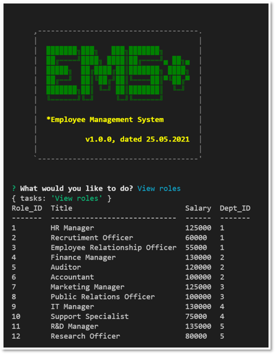

# employee-management-system

To build a command-line application that allows a user to:
  * Add departments, roles, employees
  * View departments, roles, employees
  * Update employee roles

## User Story
```
As a business owner
I want to be able to view and manage the departments, roles, and employees in a company
So that I can organize and plan my business
```

## Acceptance criteria
```
GIVEN a employee management system application
WHEN I start the application at the back-end
THEN I am presented with a few choices
WHEN I click on the choice "add a department"
THEN I am able to add a new department to the exisitng departments and similarly for "add an employee" and "add a role" choices
WHEN I click on the choice "view departments"
THEN I am presented with list of all exisitng departments and similarly for "view employees" and "view roles" choices
WHEN I click on the choice "update an employee role"
THEN I am able to update information about an employee
```

## Future development

The user will be able to perform the following tasks in the future iterations:
  * Update employee managers
  * View employees by manager
  * Delete departments
  * Delete roles
  * Delete employees
  * View total utilized budget of a department

## Terminal Commands for dependencies
  * npm i init -y
  * npm i
  * npm i [asciiart-logo](https://github.com/tomi-vanek/asciiart-logo)
  * npm i [console.table](https://www.npmjs.com/package/console.table)
  * npm i [dotenv](https://www.npmjs.com/package/dotenv)
  * npm i [InquirerJs](https://www.npmjs.com/package/inquirer/v/0.2.3)
  * npm i [MySQL](https://www.npmjs.com/package/mysql)


## Repository Link
https://github.com/marora7926/employee-management-system


## Screenshot - runTasks using "npm start"


## Example Screenshots:
  ### A. View Departments
  


  ### B. View Employees
  


  ### C. View Roles
  


## Access Walkthrough Video here
[Employee Management System Walkthrough Video](https://cloudstor.aarnet.edu.au/plus/s/xxxx)

- - -
© 2021 Mohit Arora. Confidential and Proprietary. All Rights Reserved.
